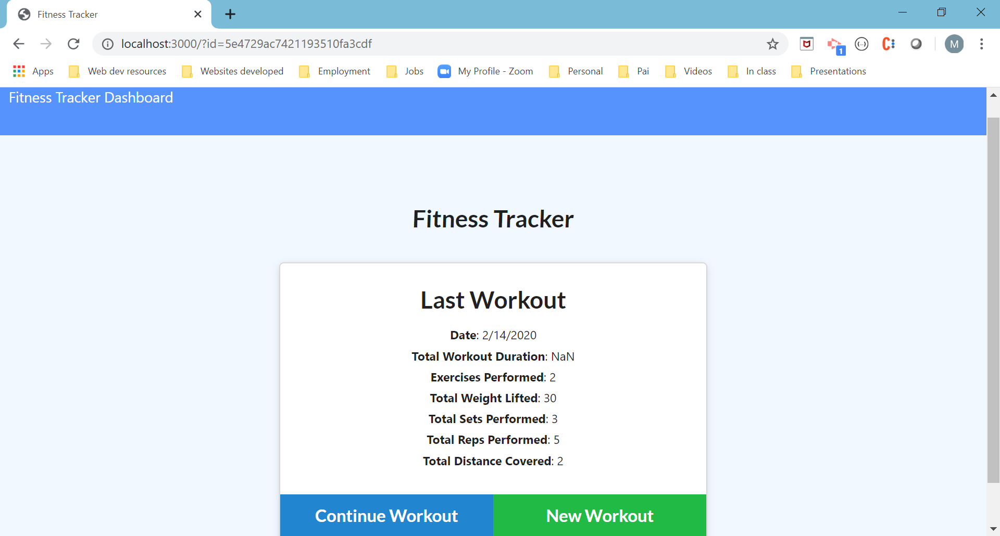
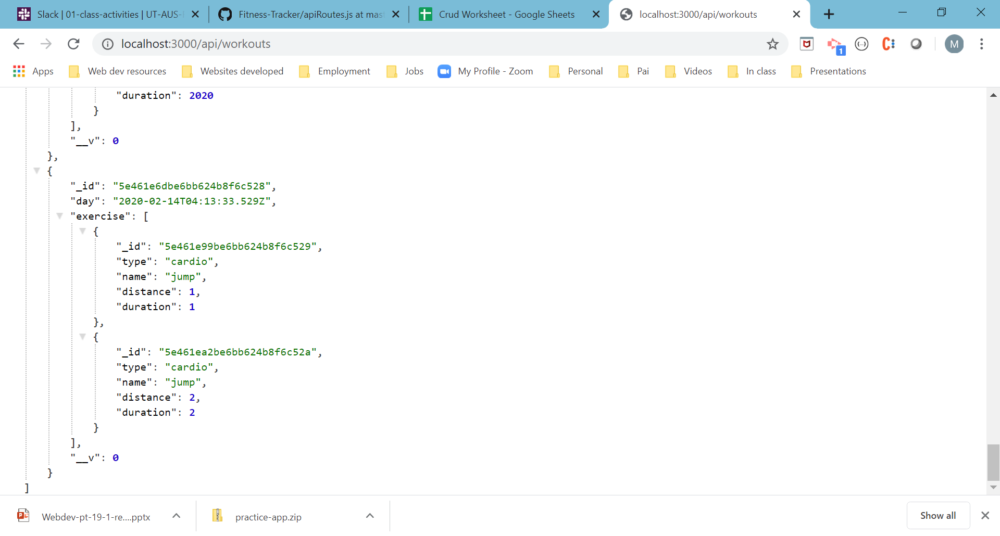
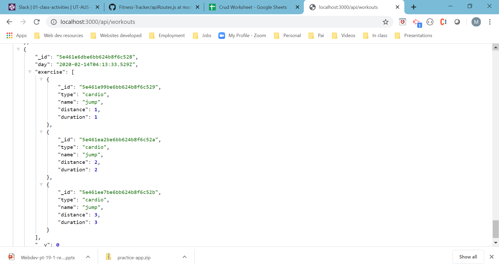

# WorkoutTracker
The project is to develop a website that tracks daily workouts. A person will reach their fitness goals quicker when they track their workout progress. The user has the option to create a new workout, or continue with their last workout. Also, the user can choose to add exercises to a previous workout plan or to add new exercises to a new workout plan.
The website creation required the creation of a Mongo database with a Mongoose schema and handle routes with Express.

## Motivation
This project is homework17 from UT Coding Bootcamp.

### Prerequisites
The software will run in any webpage.
Mongodb installation 
Express installation
npm installation 

## Screenshots

## Author
Maria Dawes-Tedesco

## Built With
* HTML, CSS, JavaScript, MOngoDB

# Contributing
Please read [CONTRIBUTING.md](https://gist.github.com/PurpleBooth/b24679402957c63ec426) for details on our code of conduct, and the process for submitting pull requests to us.

## Versioning
For the versions available, see https://mariadawes.github.io/WorkoutTracker/

## Acknowledgement
Thank you Kevin, Bhavana and Brittani for help with solving code bugs.

